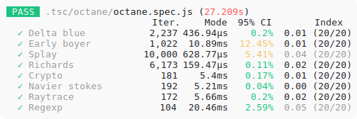

  

  <i>Reproducible benchmarking for <a href="jestjs.io">Jest</a></i>

 

## Features

 

  <picture width="503">
    <source media="(prefers-color-scheme: dark)" srcset="./docs/img/octane-dark.svg">
    
  </picture>  

- Collect performance snapshots across many runs
- Reject poor quality samples automatically
- Run benchmarks in CI runners and other poorly controlled environments
- Identify unreliable benchmarks and calibrate statistical significance in testing
- Avoid making assumptions about underlying statistical properties of benchmarks

## Get started

See [Getting started with Repris](./docs/tutorial.md).

## Docs

- See [Repris concepts and methodology](./docs/concepts.md) for a tour of Repris concepts and a description of the benchmark methodology.
- See [The statistics of Repris](./docs/statistics-of-repris.md) for more on why Repris works the way it does.
