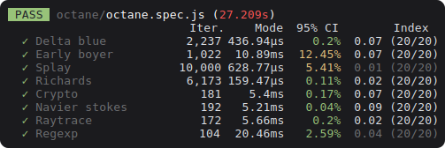

 

  

  <i>Reproducible benchmarking for <a href="jestjs.io">Jest</a></i>

 

## Features

### Collect snapshots

  

- Collect performance snapshots across many runs
- Reject poor quality samples automatically
- Run benchmarks in CI runners and other poorly controlled environments with confidence
- Identify unreliable benchmarks and automatically calibrate statistical tests

 

### Compare snapshots

  

- With the Repris CLI, use [advanced statistical methods](./docs/statistics-of-repris.md) to compare snapshots after code modification

 

## Get started

See [Getting started with Repris](./docs/tutorial.md).

## Documentation

- See [The statistics of Repris](./docs/statistics-of-repris.md) for more on why Repris works the way it does.
- See [Repris concepts and methodology](./docs/concepts.md) for a tour of Repris concepts and a description of the benchmark methodology.
